# max-ui-workshop
Some (hopefully) clever techniques for controling a Jitter patch with Max.

The first part of the workshop looks at how to build a video effects patch with Vizzie. In this second part, we look at how to put together a patch to control the other patch. Some of the things that we'll talk about include:

- Creating a global clock signal to drive a number of synchronized modulations
- Smoothing out control data to avoid sudden jumps
- Shaping a linear ramp into other kinds of control signals
- Mapping data from one patch to another with pattr
- Using bpatcher with arguments
- Using Link to synchronize with Live
- Using UDP to get data from other computers
- Analyzing audio to get control data

## Getting Started

Open `UI-control-explorer.maxproj`. This has everything that we'll be talking about contained in it. The most important thing is the slider at the bottom of the "controller" patcher.

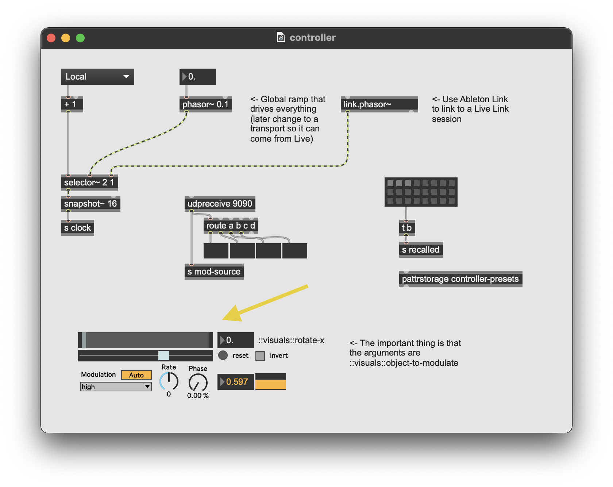

If we want to control the patch we made in the first part of the workshop to this one, then we need to do two things. First, make a `pattrmarker` object in the Vizzie patch. Give it a name. You have the option, but not the obligation, to be creative.

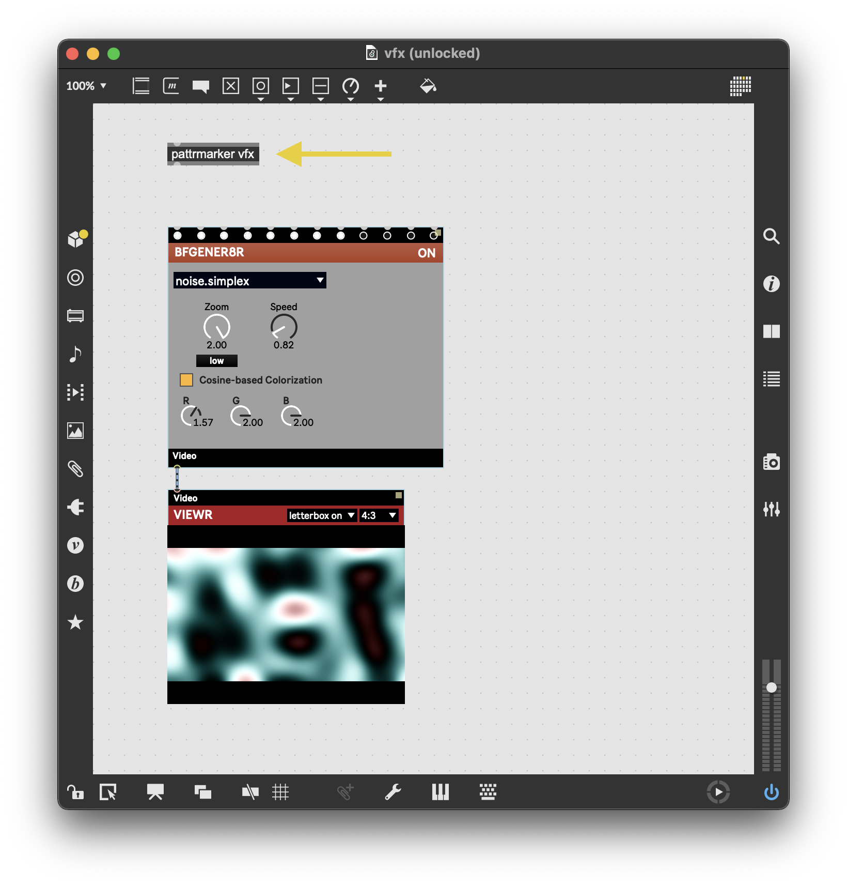

This will expose any parameter enabled objects to the global pattr system. We'll see what that means in a second. For now, add a floating point box to the video patcher that can control some parameter. Give it the range 0-1, and a scripting name.

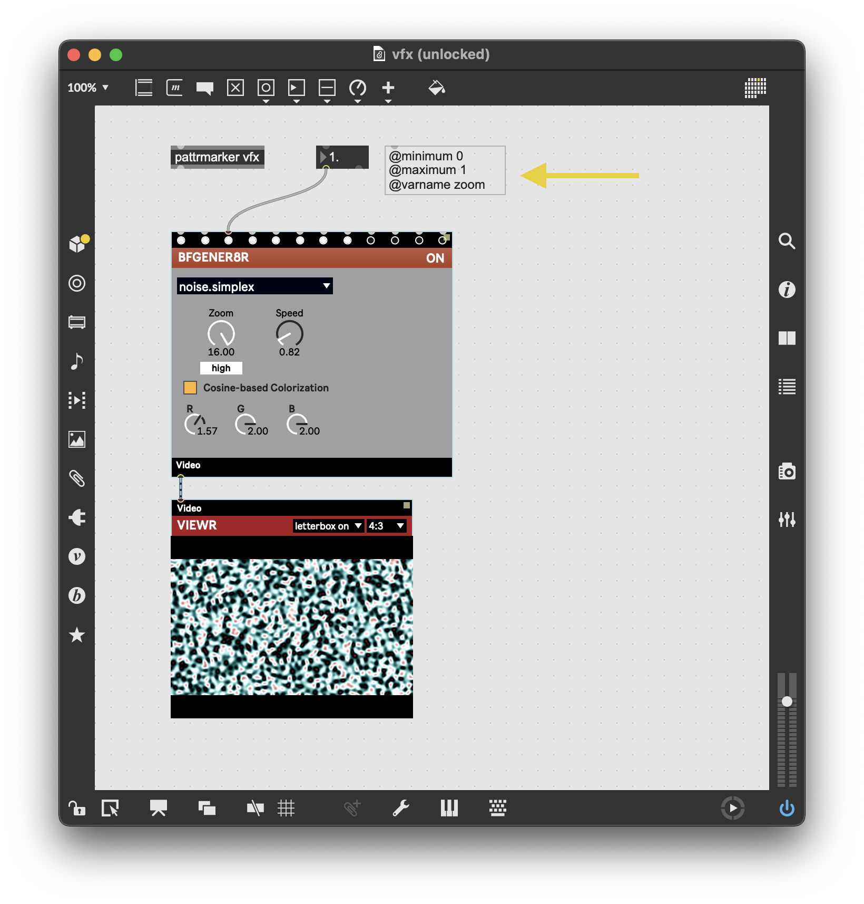

Now back in the controller patch, we can put it all together. Duplicate the slider bpatcher, and open up the inspector. Change the patcher argumetns to `::vfx::zoom` (or `::<what-you-named-your-pattrmarker>::<what-you-named-your-number-box>`). You should see the name update in the slider and you should be able to change your number box when you drag the slider.

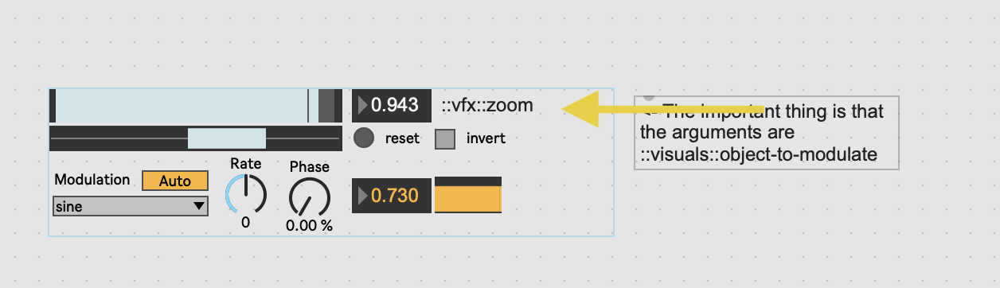

That's the essense of this whole workshop. If you want to, you can go home now, or just play with this.

## How to Use the Slider

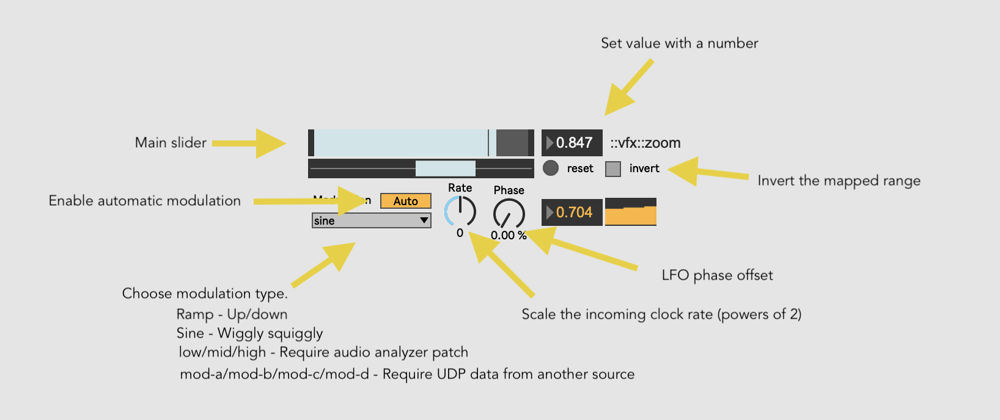

One small caveat about the slider is that, even though it's not producing any sound, it requires a lead clock to function. That clock is being generated by an audio-rate `phasor~`, so we have to turn on audio for anything to work. Also, there are some extended modulation modes that require audio analysis or incoming UDP data to work. More on that later.

## A Global Clock

If you look at the top-left of the patch, you'll see we're generating a ramp from 0-1 that's being sent out to all of the sliders. We do this rather than having an individual clock for each slider because it's more efficient, and because that way all of the sliders can be in sync, if we want.

## Smoothing Out Control Data

We're using smoothing all over this patch, in some cool ways that you might not have seen before. If you jump into the slider patch and scroll down a bit, you'll see a section that looks like this:

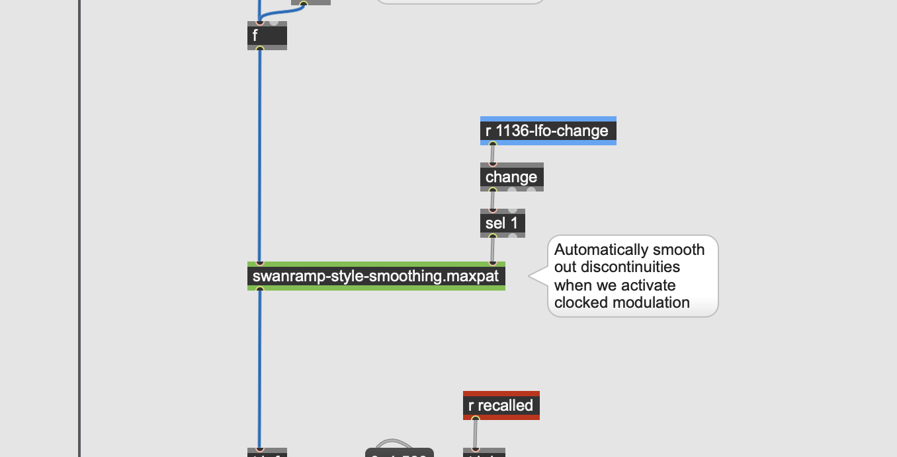

This is doing "swanramp" style smoothing, where "swanramp" is a cool-hip shorthand for switch-and-ramp. You can read more about it here http://msp.ucsd.edu/techniques/v0.11/book-html/node63.html. Essentially, imagine you have a continuous signal of some kind. Could be audio, could be control data. At some point, you know there's going to be a discontinuity. So you take a snapshot of the current signal and, instaed of putting out the discontinuity right away, slowly ease over to it over a short ramp.

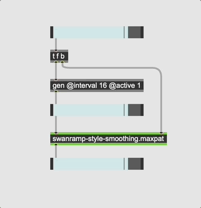

## Smoothing Out Ramps

One thing you might notice that's pretty fun is that when you change the adjusted speed of your ramp, the phasor doesn't jump right away, but rather slowly adjust to the new speed. This patches something called a phase locked loop to smooth out changes to the incoming phasor ramp in a very controlled way.

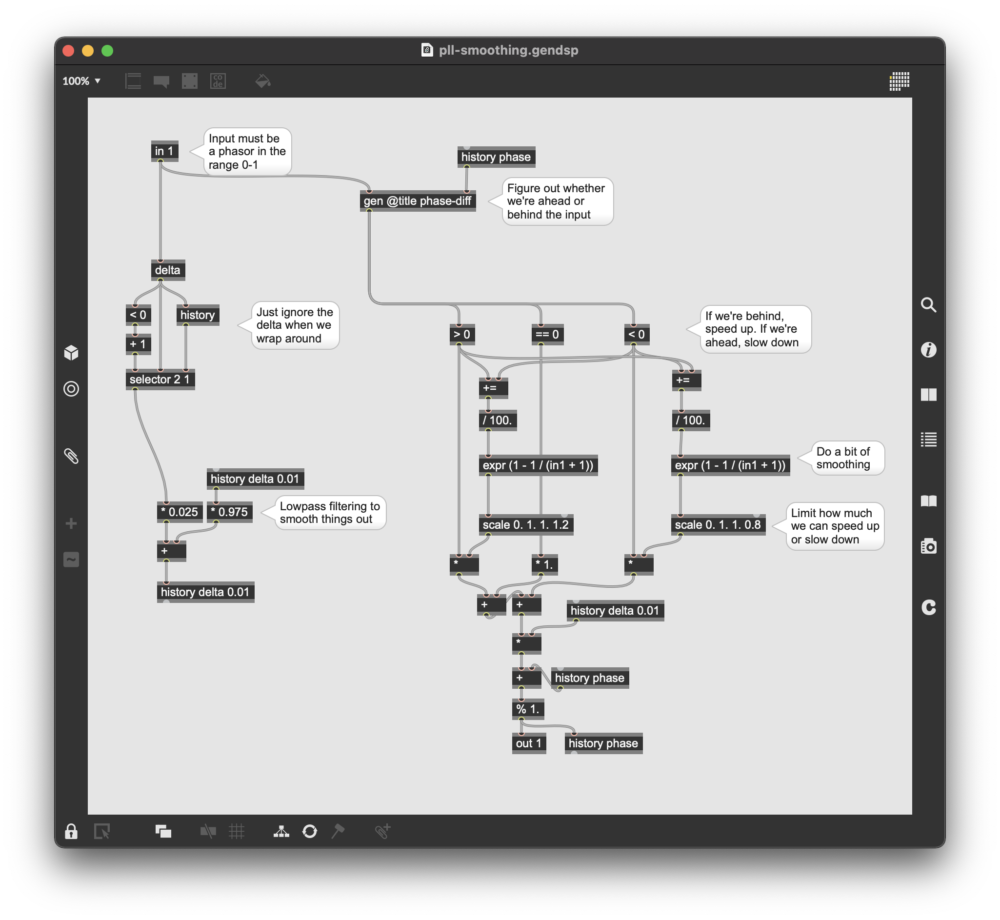

The logic is more or less what you'd expect. When we change speeds, we're essentially "tracking" a completely new phasor signal. So what we do in that case is slow down if we're ahead, and speed up if we're behind. That way we're not jumping to a new position, and we never do anything weird like suddenly go backwards.

## Shaping a Linear Ramp

Given a ramp in the range 0-1, we can do basically anything we'd like to this signal. In the sample patch, this isn't done in a super clever way. At the top level there's something like this:

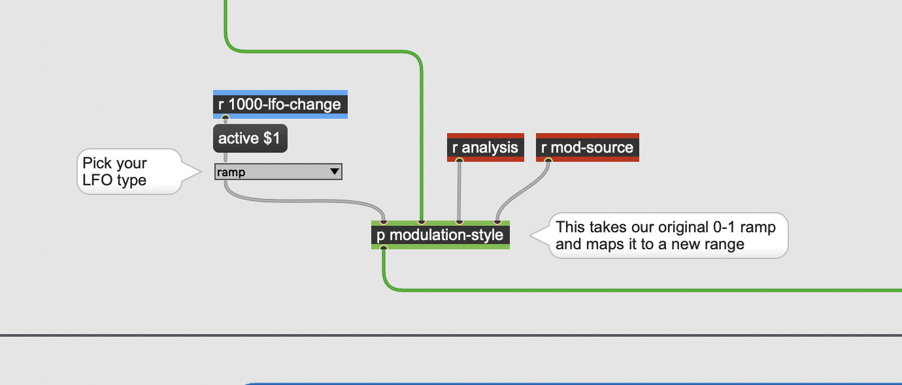

There's a `umenu` that just lets us choose between different modulation styles. If you take a look at the subpatch, what's going on shouldn't be too surprising.

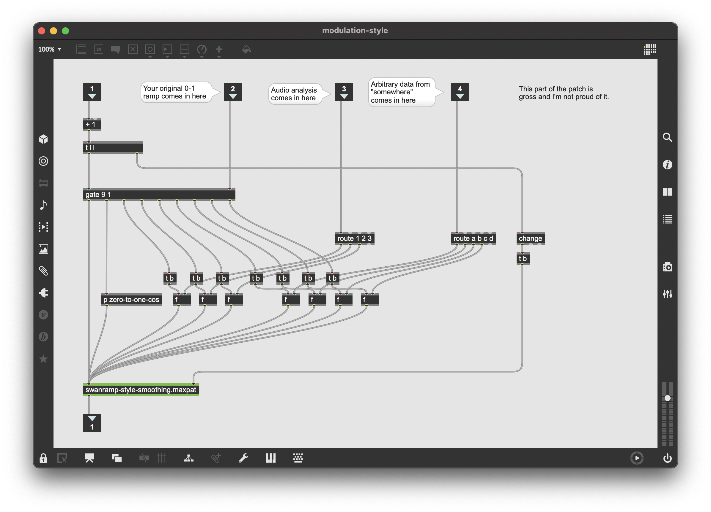

We've just got a big gate that lets us route the ramp to different functions. I couldn't think of a really clever way to handle the audio analysis and arbitrary UDP data inputs (more on that in a bit), so we can just focus up on the leftmost modulation functions. The first just sends the ramp through without any change. If we look at the second, you'll 
see a function that takes the 0-1 input and maps it to a cosine function. 

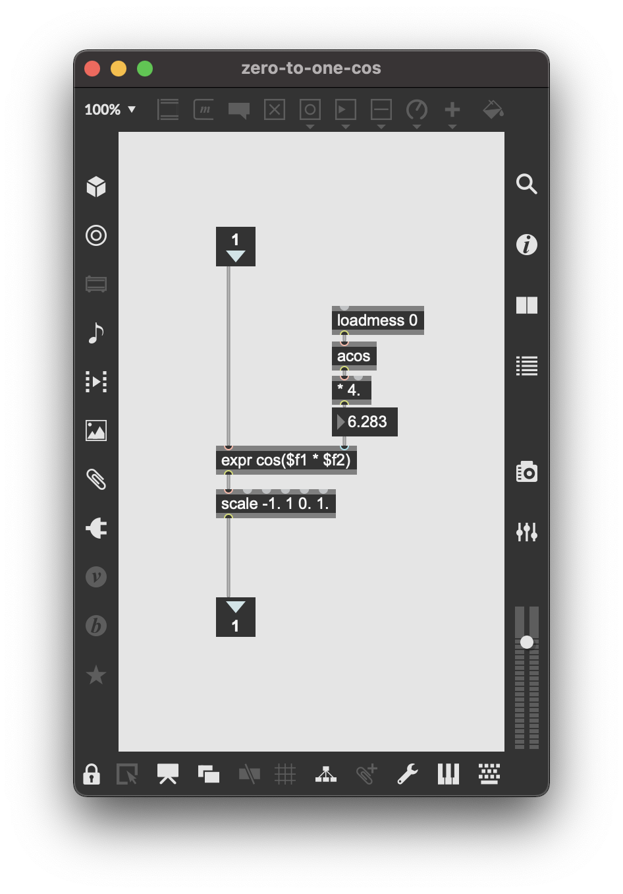

The `loadmess` thing is just a way to calculate 2 * pi. There is almost definitely a better way to do it but I couldn't think of it off the top of my head.

It might be a useful exercise at this point to come up with another function here. Maybe some repeated noise? Or maybe a function from the `ease` package?

## Mapping Data from One Patch to Another

You've probably used `send` and `receive` before to send data from one patch to another. Send and receive are totally fine, but it is kind of nice to use `pattrforward` instead. The main reason is that here you don't need an extra "thing". 

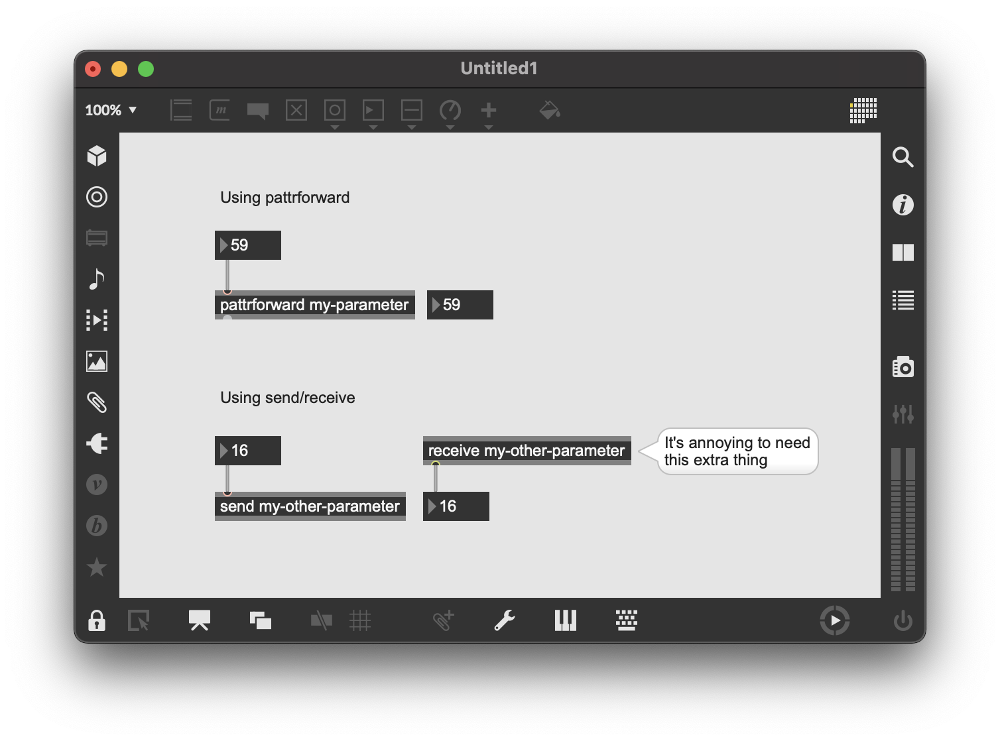

If you hook into the `pattr` system you also get some other cute stuff for free. In particular, you get this `pattrmarker` thing that essentially lets you create a namespace for every single pattr-enabled thing in your patch. So in your main "visuals" patch, or whatever you're trying to control, you don't have to come up with globally unique names for every single object in your patch, you just drop in one `pattrmarker` and everything is exposed under a global name.

If you put your pattrforward into a `bpatcher`, then you can use the `patcherargs` object to configure everything. 

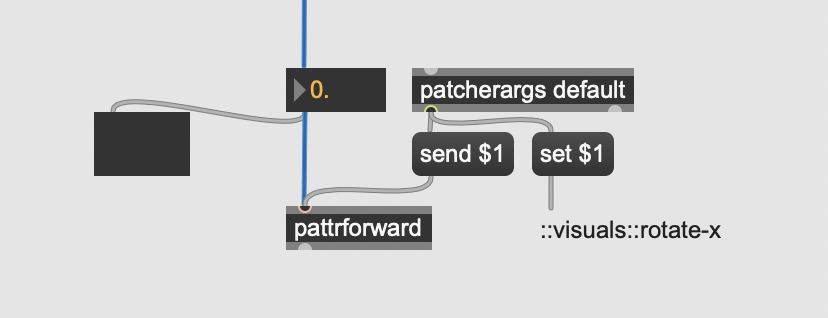

A cute benefit of hooking into the pattr world is that it's a two-way street. You can set values, but you can get values too. So you can see us using this pattr with a `bindto` to create a two-way link.

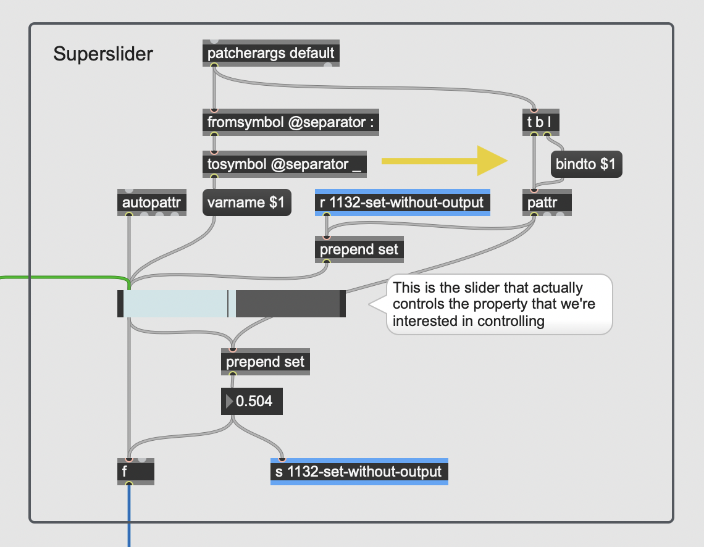

## Using Link to Synchronize with Live

Maybe you want to synchronize what's going on in your patch with a whole bunch of other stuff that's going on. Maybe you've got a buddy who's working in Live. In that case, you can use Link to keep everything in sync. You'll need the Link package from the Max package manager.

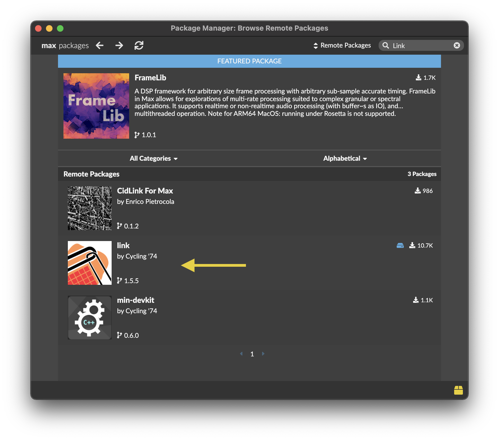

When you have the Link package, you can create a `link.phasor~` object in your patch. This will automatically create a Link "node" (or client or whatever), so that if you make tempo changes in a Live set on the same network, the `link.phasor~` object will automatically stay in sync.

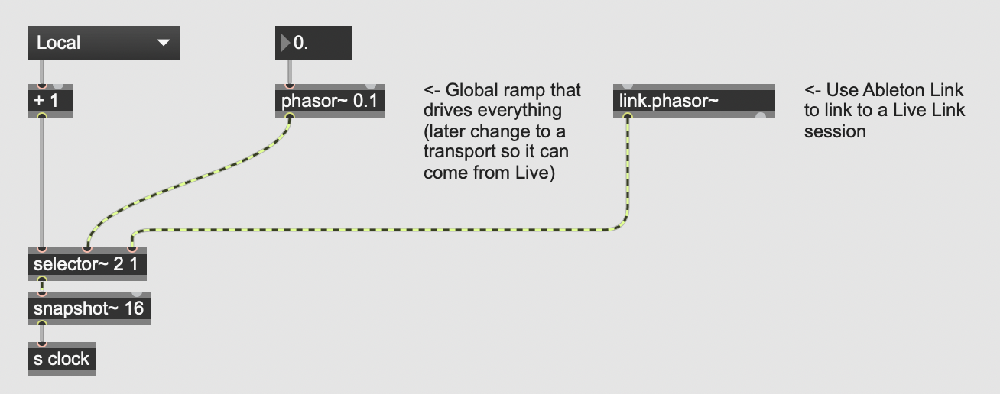

## Using UDP to Get Data from Other Computers

Okay if you want to take all this synchronization to the next level, you can use `udpsend` and `udpreceivie` to send data between machines. The materials for this workshop include a couple of Max for Live devices, "Simple Sender" and "Sender Extended" that you can use to forward data.